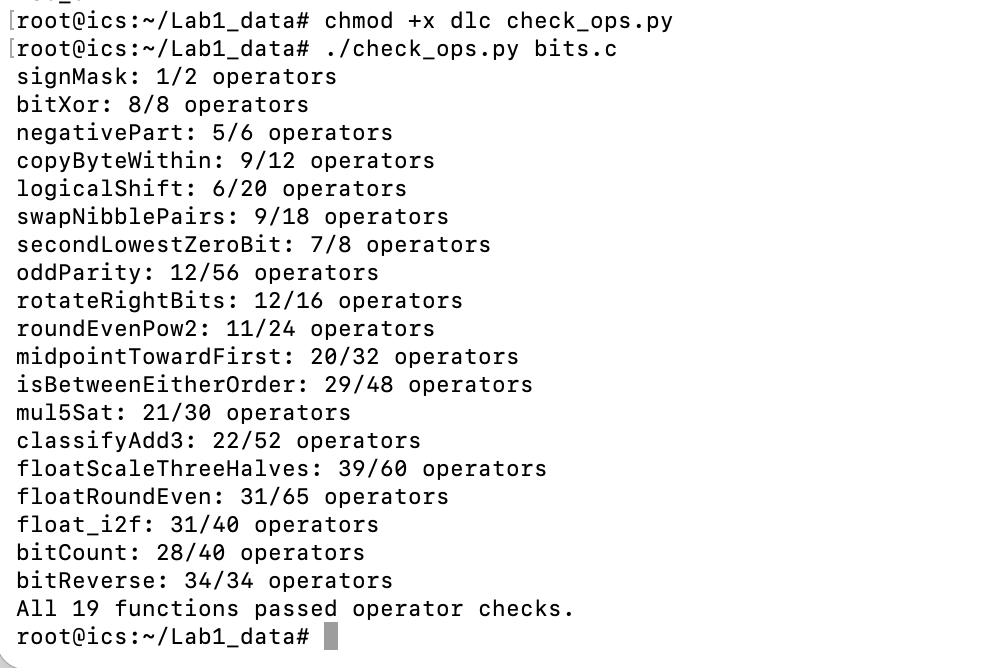
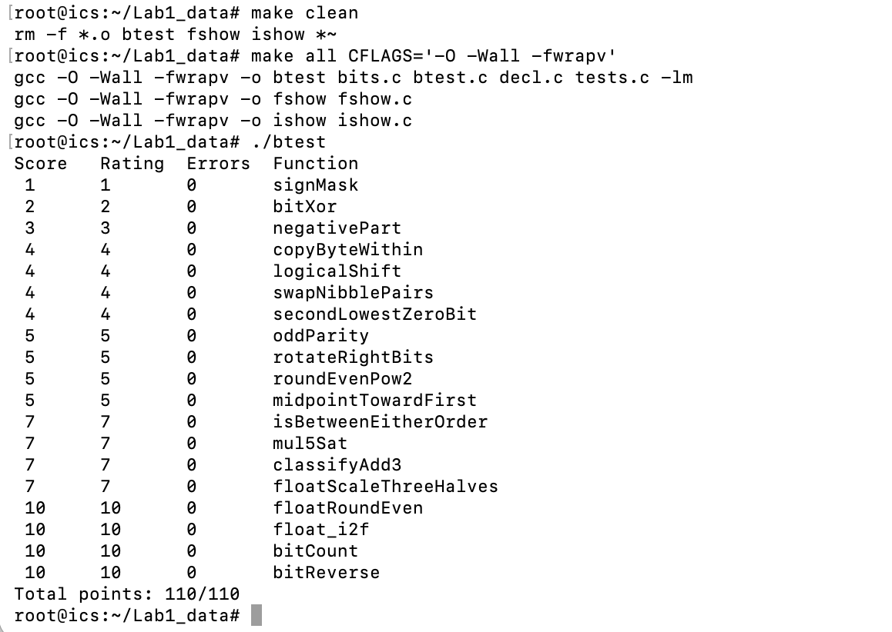

# Lab 1 Data Lab 实现报告

### 刘秉毅-25800190124

## 一、运行结果

### 运算符规则检查

在服务器终端执行 `./check_ops.py bits.c` 后，19 个函数均未超出各自的运算符限制，最后成功显示 `All 19 functions passed operator checks.`。

### 功能正确性测试

在服务器终端重新编译后执行 `./btest`，19 个函数的错误数均为 0，最终显示 `Total points: 110/110`。

## 二、逐题实现思路

### P1 `signMask`

该题需要我们做的是构造一个只有最高位为 1 的 32 位掩码。由于不能直接使用 `0x80000000` 这样的大常量，我们从允许的常量 `1` 开始，它只有第 0 位为 1。把它左移 31 位，就把这个 1 放到了符号位。其余位仍为 0，得到题目要求的位模式。

### P2 `bitXor`

该题需要我们做的是只用 `~` 和 `&` 实现 `x ^ y`。我们把结果为 1 的情况拆成“`x` 为 1、`y` 为 0”和“`x` 为 0、`y` 为 1”。这两种情况分别可写为 `x & ~y` 和 `~x & y`。最后用德摩根律将两者的或运算改写为只含 `~` 和 `&` 的表达式。

### P3 `negativePart`

该题需要我们做的是在 `x` 为负时返回 `-x`，否则返回 0。由于整数题不能使用条件语句或减号，而且 `INT_MIN` 取负涉及边界位模式，所以我们通过算术右移 `x >> 31` 得到全 0 或全 1 的符号掩码。负数时利用 `~x + 1` 形成补码意义下的相反数。最后用符号掩码保留负数分支的结果，并把非负数分支清零。

### P4 `copyByteWithin`

该题需要我们做的是把 `x` 中第 `src` 个字节复制到第 `dst` 个字节，其余字节保持不变。难点是字节编号要转换为位移量，且从最高字节右移时可能补入符号位。我们先把 `src` 和 `dst` 各自乘 8，得到相应的移位量。将源字节移到最低 8 位后，用 `0xff` 掩码清除无关位。随后清空目标字节，再把提取的字节移到目标位置并合并。

### P5 `logicalShift`

该题需要我们做的是对 `x` 实现逻辑右移 `n` 位。观察到实验中的有符号右移为算术右移，负数左侧会补 1，而逻辑右移应补 0。所以不妨先使用已有的右移运算取得低位结果，再根据 `n` 构造一个只保留有效低位的掩码。把右移结果与该掩码相与，就能清除新补入的符号位；`n=0` 和 `n=31` 也由同一公式处理。

### P6 `swapNibblePairs`

该题需要我们做的是交换 `x` 每个字节内部的高 4 位和低 4 位。难点是四个字节要同时处理，还不能直接写完整的 32 位掩码。我们由小常量 `0x0f` 拼出重复的低半字节掩码，低半字节与掩码相与后左移 4 位，进入每个字节的高半区。高半字节同理，右移 4 位后用同一掩码提取，最后将两部分合并。

### P7 `secondLowestZeroBit`

该题需要我们做的是返回标记从最低位起数第二个 0 位的独热掩码，不存在时返回 0。由于常见的逐位循环与条件判断在整数题中均不可用，所以我们先对 `x` 按位取反，使原来的 0 位变为 1 位。同时利用 `v & (v-1)` 清除最低的 1，其中减一用允许的加法和取反表示。再用 `v & -v` 取出剩余的最低 1，得到目标位置；若剩余值为 0，结果也为 0。

### P8 `oddParity`

该题需要我们做的是在 `x` 的 32 位中有偶数个 1 时返回 1，否则返回 0。我们利用异或的性质：一组位异或后的最低位表示 1 的个数的奇偶性。依次把高 16、8、4、2、1 位的信息折叠到低位。最后取最低位并做逻辑非，使偶数个 1 对应返回 1。

### P9 `rotateRightBits`

该题需要我们做的是把 `x` 向右循环移动 `n` 位。如果 `n` 可以大于 31，那么可能产生非法的 32 位移位。我们先用 `n & 31` 得到实际移动量。右移部分用掩码清除算术右移补入的符号位。左移部分把原本移出的低位绕回高位，并将左移量也控制在 0 到 31 之间，最后合并两部分。

### P10 `roundEvenPow2`

该题需要我们做的是将非负整数舍入到最近的 `2^n` 倍数，恰好居中时选商为偶数的结果。难点是半程情形需要依据原商的奇偶性决定是否进位。我们先把 `x` 看成商与余数的组合，并确定半程大小。基础偏移设为半程减一；若原商为奇数，再把偏移加一。对加过偏移的值右移再左移，就能同时处理普通舍入和最近偶数的平局规则。

### P11 `midpointTowardFirst`

该题需要我们做的是无溢出地求 `x` 与 `y` 的数学中点，半整数时选更接近 `x` 的整数。难点是直接计算 `x+y` 可能溢出，而两数大小比较也可能因减法溢出而出错。我们用 `(x & y) + ((x ^ y) >> 1)` 得到中点的下取整值。若两数异奇偶，中点恰好落在两个整数之间。此时用修正过溢出的比较结果判断 `x > y`，只有成立时才将下取整值加一。

### P12 `isBetweenEitherOrder`

该题需要我们做的是判断 `x` 是否位于端点 `a` 和 `b` 确定的闭区间内，不要求端点有固定顺序。我们分别计算 `x-a` 与 `x-b` 的 32 位结果。结合操作数和差值的符号位识别减法溢出，再修正小于判断，并单独识别相等情况，最后把 `a <= x <= b` 与 `b <= x <= a` 两种顺序合并。

### P13 `mul5Sat`

该题需要我们做的是计算 `5x`，一旦越过 `int` 范围就返回相应方向的极值。考虑到乘五的中间左移和最后相加都可能溢出，所以单看最终结果的符号不足以发现所有越界情况。我们先用 `x << 2` 得到 `4x`，再加 `x` 得到低 32 位结果。检查 `x` 的高三位是否均为符号位，以判断 `4x` 是否仍可表示；若可表示，再判断加法是否改变了符号。依据原输入的符号构造 `INT_MAX` 或 `INT_MIN`，并用掩码选择正常结果或饱和值。

### P14 `classifyAdd3`

该题需要我们做的是判断三个 `int` 的精确数学和是否越过上界或下界。难点是题目不允许更宽的整数类型，直接连续相加可能把溢出信息丢掉。我们可以把每个输入拆成带符号的高位部分与非负的低 29 位部分。这样三个低位部分之和仍在 `int` 范围内，产生的进位可以安全加入高位和。最后根据高位和是否超过 `3` 或低于 `-4`，分别返回 1、-1 或 0。

### P15 `floatScaleThreeHalves`

该题需要我们做的是根据单精度浮点位模式计算原值的 1.5 倍。首先拆出符号位、阶码和尾数，并将特殊值单独处理。同时，非规格化数对尾数字段计算三倍再除以二，并按舍弃位与结果奇偶性舍入。规格化数把隐含首位加入有效数字，乘三后重新确定移位量、调整阶码并舍入；溢出时形成同符号无穷大。

### P16 `floatRoundEven`

该题需要我们做的是把浮点值舍入为最近的整数，并把结果仍以单精度浮点位模式返回。难点是半程要取偶数，而且舍入为零时必须保留原来的正负号。我们先根据阶码区分绝对值小于 0.5、处于 0.5 到 1 之间、已经是整数以及特殊值的情况。需要实际舍入时，把有效数字分成整数部分和被舍弃的小数部分。比较小数部分与半程，并在平局时查看整数部分的最低位。若进位使有效数字超出当前阶码范围，再同步调整阶码。

### P17 `float_i2f`

该题需要我们做的是把任意 32 位有符号整数转换成单精度浮点数的位模式。需要考虑 `INT_MIN` 的绝对值不能用有符号 `int` 表示，较大的整数还会损失精度并需要舍入。我们用 `unsigned` 保存输入的绝对值，以覆盖 `INT_MIN`。找到最高的 1 后，用它的位置确定阶码并安排有效数字。若有低位被舍弃，就按最近偶数规则舍入；舍入产生新最高位时，再增加阶码。

### P18 `bitCount`

该题需要我们做的是统计 `x` 的 32 位表示中 1 的总数。我们从 `0x55`、`0x33`、`0x0f` 等小常量拼出分组掩码。先让每个 2 位组保存本组 1 的数量，再逐级合并为 4 位和 8 位组。继续合并相邻字节与半字，最终在低位得到整个 32 位数的计数。

### P19 `bitReverse`

该题需要我们做的是把 `x` 的 32 个位按相反顺序排列。难点是不能循环逐位处理，且最多只能使用 34 个运算符，最终右移还会带来符号扩展。我们先构造各级分组交换需要的掩码，并由已有掩码推导新掩码以节省运算符。依次交换相邻 1 位组、2 位组、4 位组和 8 位组。最后交换两个 16 位半字，同时用掩码去掉算术右移补入的高位；规则检查显示本题恰好使用 34 个运算符。
